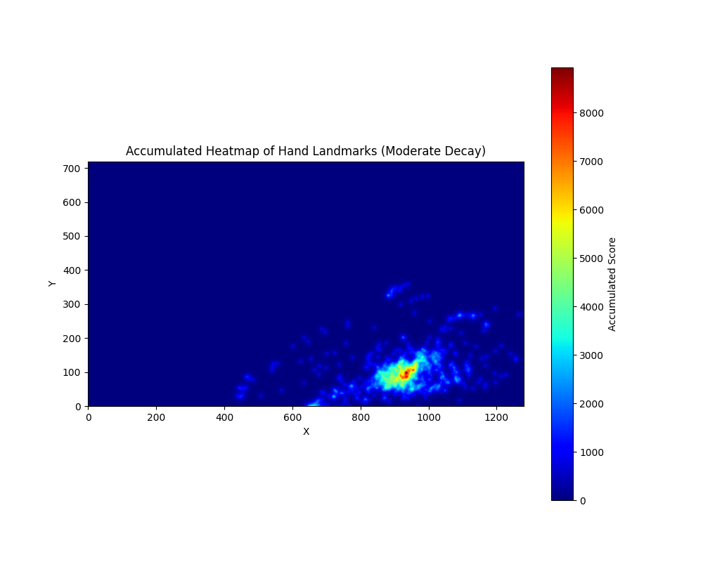

# Hand Movement Analysis Project



## 📋 Overview

This project provides tools for analyzing hand movements in video recordings by creating visual heat maps. Using computer vision and machine learning techniques, it tracks hand positions and generates insightful visualizations showing where hands appear most frequently in the frame.

## 🔍 Features

- **Hand Detection** - Accurate tracking of hand landmarks using MediaPipe
- **Video Processing** - Frame-by-frame analysis with landmark detection
- **Heat Map Generation** - Visualize hand movement patterns with customizable parameters
- **Efficient Memory Usage** - Optimized for processing large videos without excessive memory demands
- **Customizable Parameters** - Adjust influence radius, decay rates, and more

## 🛠️ Technical Details

The system identifies 21 landmarks on each hand using MediaPipe's hand tracking technology. Each landmark contributes to heat intensity through an exponential decay function, with highest values at the landmark center and decreasing as distance increases.

Key methodological choices:
- **Influence Radius**: 40 pixels around each coordinate
- **Decay Function**: Exponential decay for smooth transitions
- **Cumulative Mapping**: Aggregates hand positions across all analyzed frames

## 📊 Applications

- **Developmental Psychology**: Compare hand movement patterns across different age groups
- **Ergonomics**: Analyze hand positioning for interface design
- **Physical Therapy**: Track progress in motor skills rehabilitation
- **Human-Computer Interaction**: Study gesture patterns for interactive systems

## 💻 Installation

```bash
# Clone the repository
git clone https://github.com/YonaDassa/Project-Hands.git
cd Project-Hands

# Create and activate virtual environment
python3 -m venv venv
source venv/bin/activate

# Install dependencies
pip install opencv-python mediapipe numpy matplotlib pandas
```

## 🚀 Usage

### Basic Usage

```bash
# Process video and generate hand coordinate data
python hands.py

# Generate heat map from coordinates
python hot_maps.py
```

### For Large Videos

```bash
# Process every 10th frame (faster processing)
python skip_frame.py

# Generate memory-efficient heat map
python hot_maps.py
```

## ⚙️ Configuration

Edit the scripts to adjust these parameters:

- `video_path`: Path to your input video
- `radius`: Influence radius around each hand landmark (default: 40 pixels)
- `decay_rate`: Rate at which influence decreases with distance (default: 0.2)
- `center_score`: Maximum influence value at the center point (default: 1000)

## 📈 Output

The system produces:

1. **CSV Data File**: Contains frame numbers and X,Y,Z coordinates for each hand landmark
2. **Processed Video**: Shows the original video with hand landmarks overlaid
3. **Heat Map Image**: Visual representation of hand position frequency

## 🔬 Research Applications

This tool enables quantitative analysis of spatial characteristics like distribution, symmetry, and concentration of hand movements. Researchers can track changes in these patterns over time to study motor cognition and spatial perception development.

## 🤝 Contributing

Contributions are welcome! Please feel free to submit a Pull Request.

## 📄 License

This project is licensed under the MIT License - see the LICENSE file for details.
